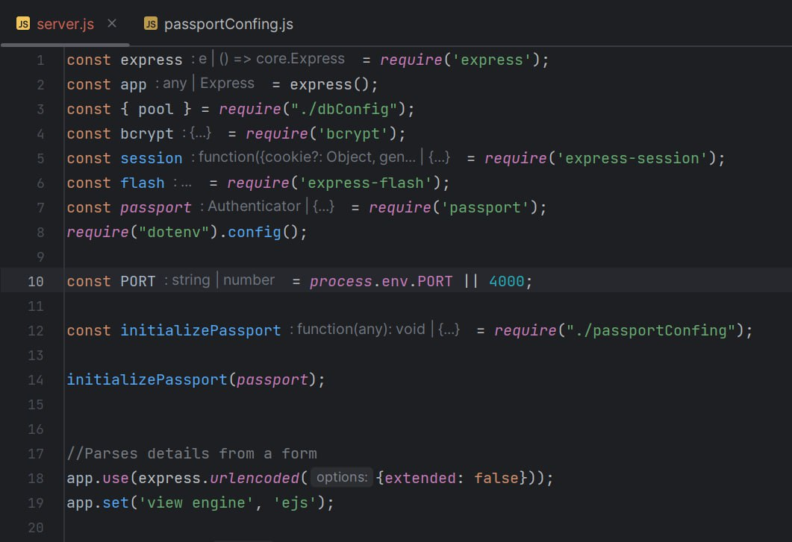
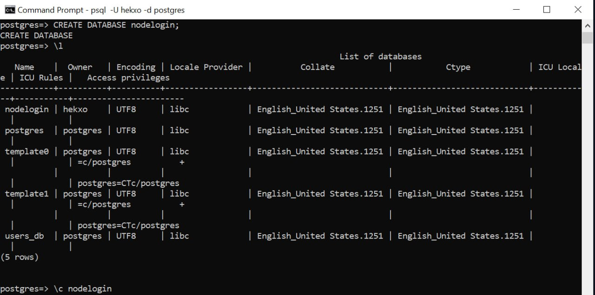
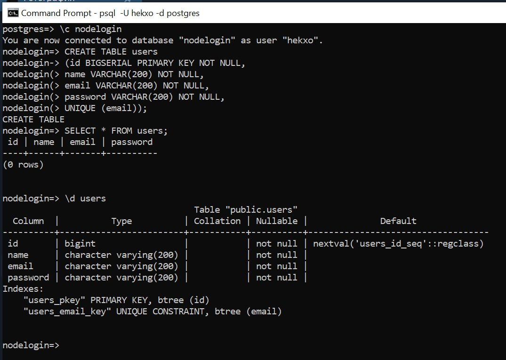
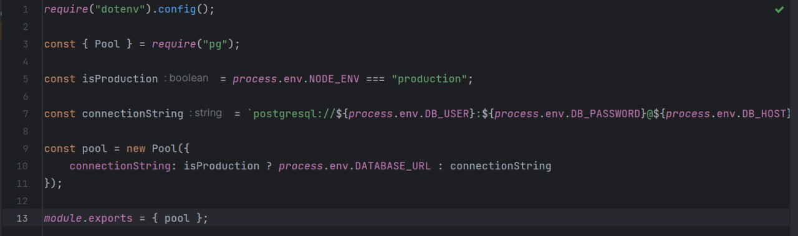
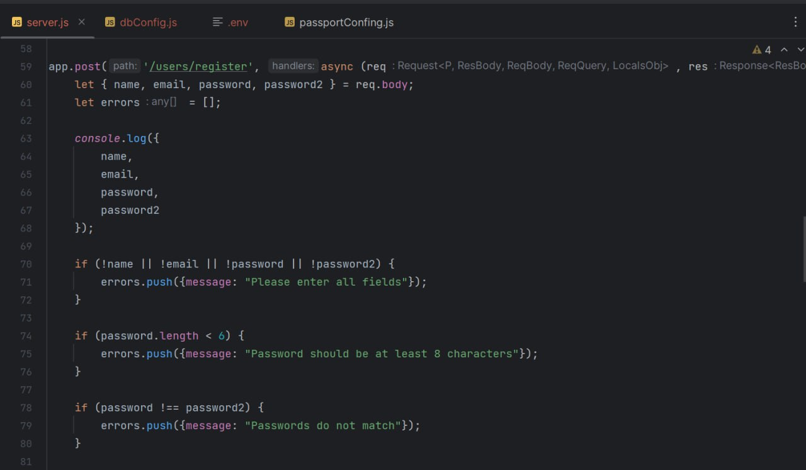

# Web Technologies 2 (Back End). Assignment 1
**Project Name:** Creating a Registration and Login System with Node.js and PostgreSQL  
**Group:** SE-2210  
**Group members:** Ramin Sagandykov, Mukhammed Kaskyrbayev, Bekzat Kanay
## Table of Contents
- [Objective](#objective)
- [Requirements](#requirements)
- [Main Body](#main-body)
    - [Dependencies](#dependencies)
    - [PostgreSql](#postgresql)
    - [NodeJS](#nodejs)

## Objective
The goal of this assignment is to design and implement a back-end system for user registration and login using Node.js as the server-side framework and PostgreSQL as the database.

## Requirements
-Setup and Installation;
 -Registration Form;
 -Login Form;
 -Database Interaction.

## Main Body
### Dependencies
Dependencies that were installed before the creating the project  
`express` - To serve our application 
`bcrypt` - To hash user password to make them secure 
`express-session` - To store session details in a session cookie object 
`express-flash` - To display flash messages to the user 
`passport` - To authenticate users 
`passport-local` - To implement a local authentication strategy for our application
 

### PostgreSql
Creating the database: 

Creating the table with users's data: 

Connect with database: 

### NodeJS
Creating asyncronous method "post" to handle register, validation form

Creating the method "query" to work with database by using SELECT and INSERT INTO methods 
.jpeg)
 
.jpeg)

